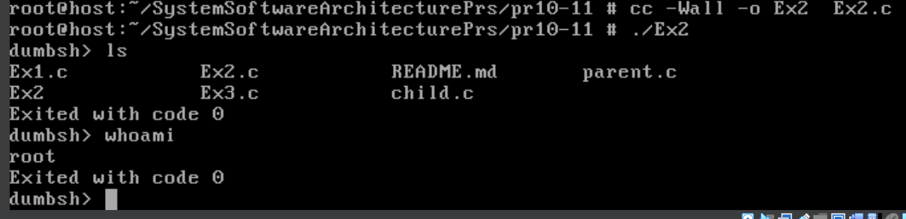
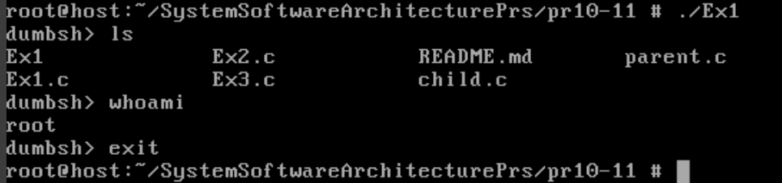
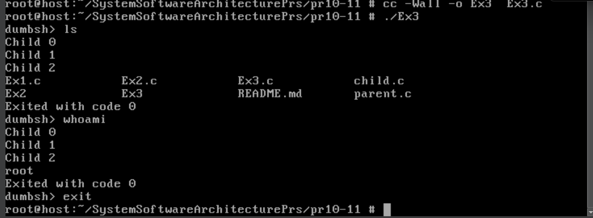
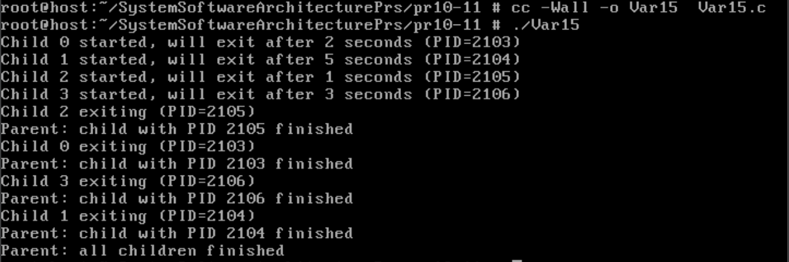

# Практична робота №10-11

## Завдання з DumbShell
Реалізовано просту командну оболонку (shell), яка зчитує команди користувача, створює дочірній процес для виконання команди через `execlp` і чекає завершення. Вихід — по команді "exit".
### Результат роботи

## Завдання з API wait
Додано обробку статусу завершення дочірнього процесу через `wait(&status)` і макроси `WIFEXITED`, `WEXITSTATUS`, `WIFSIGNALED`, `WTERMSIG`. Це дозволяє повідомити користувача, як саме завершилась команда.
### Результат роботи

## Fork Bomb
Shell-скрипт `:(){ :|:& };:` створює експоненційно зростаючу кількість процесів, що швидко виснажує ресурси системи. Використовується для демонстрації важливості обмеження кількості процесів.
<!-- результат роботи не додається, оскільки це шкідливий приклад -->

## Приклад створення кількох дітей
Перед виконанням основної команди створюються три додаткові дочірні процеси, які одразу завершуються. Батьківський процес чекає завершення всіх трьох, потім виконує основну команду і повідомляє про результат її завершення.
### Результат роботи

## Завдання №15
Створіть декілька процесів, які завершуються з різною затримкою. Спостерігайте в батьківському процесі, як wait() повертає PID завершених процесів у довільному порядку.

### Реалізація завдання
Програма створює масив із 4 дочірніх процесів. Для кожного процесу задається своя затримка (1, 2, 3, 5 секунд).  
У циклі `fork()` створює дочірній процес, который сразу сообщает о запуске, затем засыпает на заданное время и завершает работу.  
Родительский процесс сохраняет PID каждого ребенка. После создания всех процессов родитель в цикле вызывает `wait()`, который возвращает PID завершившегося процесса (в порядке их фактического завершения, а не создания). Для каждого завершившегося процесса родитель выводит его PID.  
В конце выводится сообщение о завершении всіх дочірніх процесів.

### Результат роботи
