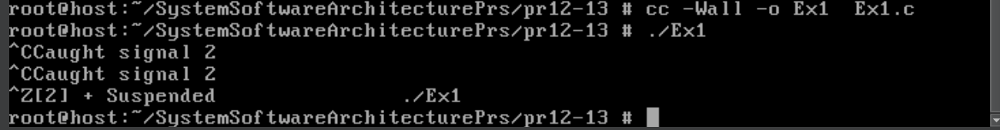
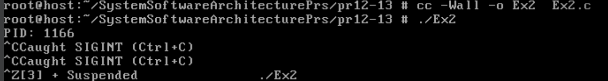
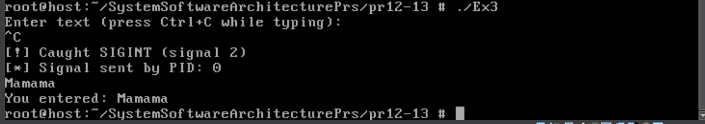
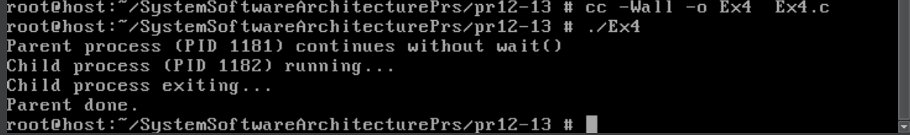
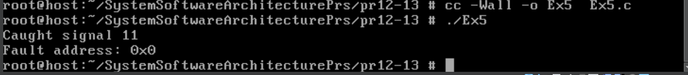
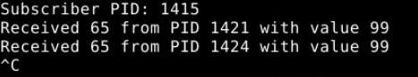

# Практична робота №12-13
## Handling Signals
Програма ілюструє встановлення обробника сигналу `SIGINT`. При натисканні `Ctrl+C` виконання не переривається, а виводиться повідомлення з номером сигналу.
### Результат роботи:

## A Simple C Program that Handles a Couple of Signals
Демонструється обробка двох сигналів: при `SIGINT` (Ctrl+C) програма повідомляє про отримання сигналу, а при `SIGTERM` — коректно завершує роботу. Виводиться PID процесу, програма працює у нескінченному циклі.
### Результат роботи:

## Sigaction Flags
Показано використання розширених можливостей `sigaction()` для сигналу `SIGINT`: обробник виводить повідомлення та PID відправника, не перериваючи системний виклик `read()`.
### Результат роботи:

## No Zombies
Програма демонструє створення дочірнього процесу без появи зомбі-процесів. Для цього використовується ігнорування сигналу `SIGCHLD` (`SIG_IGN`) та прапор `SA_NOCLDWAIT`.
### Результат роботи:

## Trapping and Extracting Information from a Crash
Реалізовано обробку аварійного завершення (`SIGSEGV`) через розширений обробник сигналу. Виводиться номер сигналу та адреса помилки, після чого програма завершується.
### Результат роботи:

## A Small Publisher-Subscriber Type of Application
Два процеси взаємодіють через сигнал `SIGRTMIN`: один (publisher) надсилає сигнал із числовим значенням, інший (subscriber) отримує його та виводить інформацію про відправника і значення.
### Результат роботи:

## Завдання №15
Реалізуйте контролер, який реагує на сигнали від кількох процесів, сортує події за часом отримання та будує часову лінію у вигляді графу.

### Реалізація завдання
Програма працює як контролер сигналів. Вона встановлює обробники для сигналів `SIGUSR1` та `SIGUSR2` з використанням `sigaction` і прапора `SA_SIGINFO`, щоб отримувати додаткову інформацію про відправника сигналу (PID). При отриманні сигналу обробник зберігає у масиві подій тип сигналу, час отримання та PID відправника. Для завершення роботи використовується сигнал `SIGINT` (Ctrl+C), на який встановлюється окремий обробник, що переводить програму у режим завершення. Після завершення програма сортує всі події за часом отримання, виводить їх у вигляді списку з часом, PID і типом сигналу, а також будує ASCII-таймлайн, де кожна подія відображається символом `*` з підписом типу сигналу.

### Результат роботи
