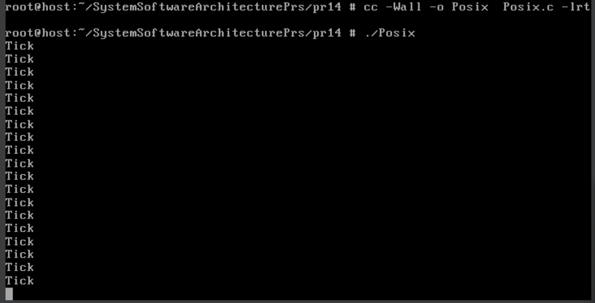
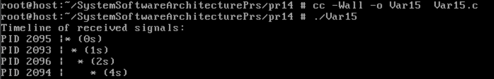

# Практична робота №14
## Example program – POSIX interval timers
Код, який представлений в лекції, демонструє використання *POSIX-таймера з інтервалом* для періодичної генерації сигналів. Замість стандартних сигналів використовується `SIGRTMIN`, щоб уникнути конфліктів із системними сигналами. Структура `sigaction` налаштована з прапором `SA_SIGINFO`, що дозволяє використовувати розширений обробник `sa_sigaction`. Таймер створюється через `timer_create()` і налаштовується на генерацію сигналу щосекунди (`it_interval`). У відповідь на сигнал виводиться повідомлення "Tick" за допомогою `write()`. Цикл `pause()` утримує програму активною, очікуючи сигнали.
### Результат роботи

## Завдання №15

### Реалізація завдання

### Результат роботи
