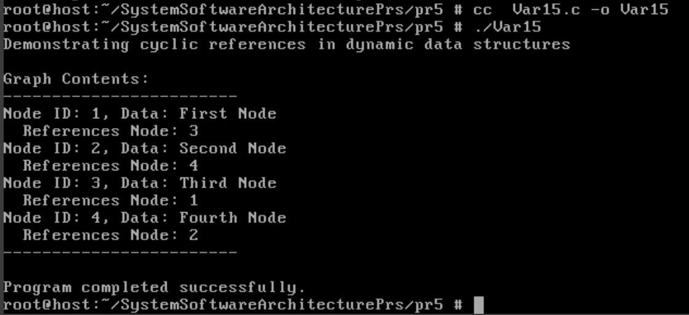
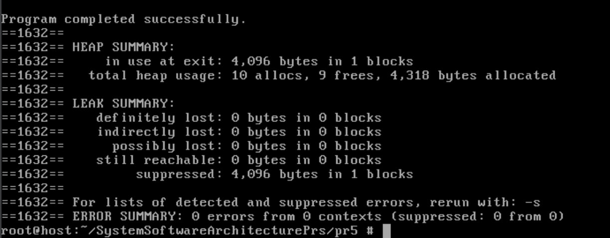

# Практична робота №5
Реалізуйте динамічну структуру даних, де циклічні посилання заважають звільненню всієї пам’яті.

## Завдання
Побудуйте програму, яка виділяє пам’ять за допомогою mmap() і втрачає її після fork() — без ознак у valgrind.

## Реалізація завдання
У програмі реалізовано двозв'язну структуру даних `Node` з додатковим посиланням, що може створювати цикли:
```c
typedef struct Node {
    int id;
    char* data;
    struct Node* next;
    struct Node* prev;
    struct Node* reference;  // Додаткове посилання, що може створювати цикл
} Node;
```
Структура `Graph` використовується для управління колекцією вузлів:
```c
typedef struct Graph {
    Node* head;
    int size;
} Graph;
```
У програмі створюються вузли та встановлюються між ними циклічні посилання:
```c
createCyclicReference(graph, 1, 3);
createCyclicReference(graph, 2, 4);
createCyclicReference(graph, 3, 1);  // Створює цикл: 1 -> 3 -> 1
createCyclicReference(graph, 4, 2);  // Створює цикл: 2 -> 4 -> 2
```
---
### Проблема
Циклічні посилання в структурах даних призводять до наступних проблем:

1. **Витоки пам'яті** - стандартні функції звільнення пам'яті не можуть коректно звільнити всі об'єкти у циклі
2. **Використання вже звільненої пам'яті** - при спробі звільнити об'єкти у певному порядку можуть виникати звернення до вже звільнених ділянок пам'яті
3. **Ускладнення управління ресурсами** - складно відстежити, коли об'єкт більше не використовується

Це особливо критично для серверних та довгоживучих програм у FreeBSD, де накопичення витоків пам'яті з часом може призвести до вичерпання системних ресурсів.
---
### Вирішення проблеми
У функції `correctFreeGraph()` використовується двоетапний процес звільнення пам'яті:
```c
void correctFreeGraph(Graph* graph) {
    Node* current = graph->head;
    Node* next;
    
    // Перший прохід: розрив усіх циклічних посилань
    while (current) {
        current->reference = NULL;
        current = current->next;
    }
    
    // Другий прохід: звільнення пам'яті кожного вузла
    current = graph->head;
    while (current) {
        next = current->next;
        free(current->data);
        free(current);
        current = next;
    }
    
    // Звільнення пам'яті графа
    free(graph);
}
```
---
### Результати запуску
При запуску програми вона:
1. Створює граф з чотирма вузлами
2. Встановлює циклічні посилання між вузлами
3. Відображає структуру графа з інформацією про посилання
4. Коректно звільняє всю пам'ять, уникаючи витоків

Результат:



---
### Перевірка на витоки пам'яті
Для перевірки на витоки пам'яті можна використати інструмент Valgrind:
```bash
valgrind --leak-check=full ./Var15
```

При правильній реалізації функції `correctFreeGraph()` Valgrind не виявить витоків пам'яті.



---
### Висновок
Ця програма демонструє важливу проблему управління пам'яттю у FreeBSD при роботі зі структурами даних, що містять циклічні посилання. Основні висновки:

1. **Циклічні посилання** є поширеною причиною витоків пам'яті в динамічних структурах даних.

2. **Двоетапний підхід до звільнення пам'яті** (спочатку розрив циклів, потім звільнення об'єктів) є ефективним рішенням цієї проблеми.

3. **Системне програмування в FreeBSD** вимагає уважного ставлення до управління пам'яттю, особливо коли використовуються складні структури даних з перехресними посиланнями.

4. **Правильний дизайн структур даних** має враховувати напрямок посилань та потенційні цикли з самого початку розробки.

Розуміння та вміння вирішувати подібні проблеми є критичними навичками для розробників системного програмного забезпечення, особливо для систем з обмеженими ресурсами або високими вимогами до надійності.