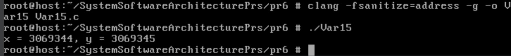

# Практична робота №6
## Test Case #1 — Неініціалізоване читання змінної
### Опис завдання
Метою цього тесту є демонстрація помилки **неініціалізованого читання** — використання значення змінної до її ініціалізації у мові програмування **C**. Такі помилки є поширеним джерелом непередбачуваної поведінки програм у системному програмуванні, зокрема під Linux. Для виявлення помилки використовувався інструмент **AddressSanitizer (ASan)**, який дозволяє виявити різні типи порушень доступу до пам'яті.

---
### Код програми
```c
#include <stdio.h>

int main() {
    int x;         
    int y = x + 1;     // Читання неініціалізованої змінної
    printf("y = %d\n", y);
    return 0;
}
```

---
### Проведене тестування
1. Програму було скомпільовано з підтримкою **AddressSanitizer**:
   ```bash
   clang -fsanitize=address -g -o Var15 Var15.c
   ```
2. Запуск програми для виявлення помилки:
   ```bash
   ./Var15
   ```
3. Спостереження: Програма вивела випадкове значення для x та y



Однак AddressSanitizer не видав повідомлення про помилку, що вказує на неініціалізоване читання змінної x.

---
### Висновки
- Програма демонструє неініціалізоване читання, що підтверджується виведенням випадкового значення для y.
- AddressSanitizer не вияви помилку при компіляції з прапорами -fsanitize=address або -fsanitize=address,undefined. Це може бути спричинено:
  - Оптимізацією компілятора (рекомендується використовувати -O0).
  - Обмеженнями версії Clang на FreeBSD.

- Уникати таких ситуацій можна за допомогою:
  - завжди ініціалізувати змінні перед їх використанням
  - використовувати компіляцію з попередженнями (`-Wall`, `-Wextra`, `-Werror`)
  - застосовувати інструменти динамічного аналізу, такі як AddressSanitizer або Valgrind
  - використовувати статичний аналіз коду