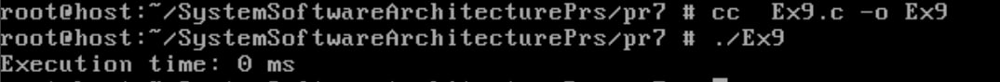

# Практична робота №7
## Завдання №1
Використайте popen(), щоб передати вивід команди rwho (команда UNIX) до more (команда UNIX) у програмі на C.
## Реалізація завдання
Команда `rwho` на FreeBSD (і в UNIX загалом) працює лише якщо запущений демон `rwhod` і в мережі є активні клієнти, які його використовують.
Якщо на локальній машині немає інших комп’ютерів з активним `rwhod`, `rwho` поверне порожній результат.

Програма використовує функцію `popen()` для запуску двох команд: спочатку запускає `rwho` у режимі читання,
потім відкриває `more` у режимі запису. Вивід `rwho` читається рядок за рядком і передається в `more` для посторінкового перегляду.
В кінці програма закриває обидва потоки за допомогою `pclose()`, коректно завершуючи роботу.

## Результат роботи:

## Завдання №2
Напишіть програму мовою C, яка імітує команду `ls -l` в UNIX — виводить список усіх файлів у поточному каталозі та перелічує права доступу тощо. (Варіант вирішення, що просто виконує `ls -l` із вашої програми, — не підходить.)
## Реалізація завдання
Ця програма імітує базову версію команди `ls -l` у UNIX.

Вона відкриває поточний каталог, читає всі файли, окрім "." та "..", 
і виводить інформацію про кожен файл:

- тип файлу (звичайний, директорія, символічне посилання тощо),
- права доступу (rwxrwxrwx),
- кількість жорстких посилань,
- власник файлу,
- група файлу,
- розмір файлу в байтах,
- дату та час останньої модифікації,
- ім'я файлу,
- якщо це символічне посилання — ціль посилання.

Для отримання інформації про файли використовуються системні виклики `lstat`, `getpwuid`, `getgrgid`.
Формат виводу максимально наближений до стандартного `ls -l`.

## Результат роботи:

## Завдання №3
Напишіть програму, яка друкує рядки з файлу, що містять слово, передане як аргумент програми (проста версія утиліти grep в UNIX).
## Реалізація завдання
Ця програма — спрощена версія утиліти `grep` у UNIX.

Вона приймає два аргументи командного рядка:
1. Слово для пошуку
2. Ім'я файлу

Програма відкриває вказаний файл, читає його рядок за рядком і виводить
ті рядки, які містять задане слово.

**Приклад використання**: команда `./simple_grep hello example.txt` 

## Результат роботи:

## Завдання №4
Напишіть програму, яка виводить список файлів, заданих у вигляді аргументів, з зупинкою кожні 20 рядків, доки не буде натиснута клавіша (спрощена версія утиліти more в UNIX).
## Результат роботи:
Було написано програму, яка реалізує спрощену версію утиліти `more`, виводячи вміст файлів із паузами кожні 20 рядків.

Основні етапи роботи даної програми:
- **Обробка аргументів**: перевіряє, чи передані файли для виводу. Якщо ні — виводить підказку щодо використання.
- **Відкриття файлу**: відкриває файл для читання. Якщо файл не знайдено або виникає помилка, виводить повідомлення про помилку.
- **Читання рядків**: за допомогою `fgets()` послідовно зчитує рядки файлу.
- **Лічильник рядків**: після виводу кожних 20 рядків програма зупиняється і чекає, доки користувач натисне клавішу Enter (`getchar()`), щоб продовжити вивід.
- **Обробка кількох файлів**: якщо у аргументах задано кілька файлів, програма по черзі виводить вміст кожного, попередньо виводячи заголовок з ім'ям файлу.
- **Закриття файлу**: після повного читання файл закривається за допомогою `fclose()`.

## Результат роботи:

## Завдання №5
Напишіть програму, яка перелічує всі файли в поточному каталозі та всі файли в підкаталогах.
## Реалізація завдання
Ця програма рекурсивно перелічує всі файли та каталоги, починаючи з поточного каталогу, а також усі файли у підкаталогах.

Реалізація:
- Використовується функція `list_files_recursive`, яка приймає шлях до каталогу.
- Відкриває каталог за допомогою `opendir()`.
- Перебирає усі записи каталогу за допомогою `readdir()`.
- Пропускає записи `.` та `..`, щоб уникнути зациклення.
- Для кожного запису формує повний шлях (`fullpath`).
- Виконує `stat()` для отримання інформації про тип файлу.
- Виводить повний шлях до файлу або каталогу.
- Якщо запис є каталогом, рекурсивно викликає себе для цього підкаталогу.
- Після обробки закриває каталог викликом `closedir()`.

Таким чином програма виводить всі файли та каталоги у дереві починаючи з поточного каталогу.

## Результат роботи:

## Завдання №6
Напишіть програму, яка перелічує лише підкаталоги у алфавітному порядку.
## Реалізація завдання
Ця програма виводить список лише підкаталогів поточного каталогу у алфавітному порядку.

Реалізація:
- Відкриває поточний каталог за допомогою `opendir()`.
- Перебирає усі записи каталогу функцією `readdir()`.
- Пропускає записи `.` та `..`.
- Для кожного запису виконує `stat()` і перевіряє, чи є це каталогом (`S_ISDIR`).
- Зберігає назви підкаталогів у масиві рядків.
- Використовує `qsort()` для сортування рядків за алфавітом.
- Виводить відсортовані назви підкаталогів з додаванням символу `/` наприкінці.
- Звільняє виділену пам’ять та закриває каталог.

Таким чином програма демонструє базову роботу з файловою системою, сортування рядків і управління пам’яттю.

## Результат роботи:

## Завдання №7
Напишіть програму, яка показує користувачу всі його/її вихідні програми на C, а потім в інтерактивному режимі запитує, чи потрібно надати іншим дозвіл на читання (read permission); у разі ствердної відповіді — такий дозвіл повинен бути наданий.
## Реалізація завдання
Ця програма знаходить у поточному каталозі всі файли з розширенням `.c` (вихідні програми на C) і виводить їх користувачу.

Реалізація:
- Відкриває поточний каталог за допомогою `opendir()`.
- Перебирає усі файли в каталозі через `readdir()`.
- Фільтрує файли, що мають розширення `.c`.
- Для кожного такого файлу в інтерактивному режимі запитує користувача, чи надати іншим користувачам дозвіл на читання (read permission).
- Якщо користувач відповідає "так" (`y` або `Y`), то за допомогою `chmod()` додає дозвіл `S_IROTH`.
- Якщо користувач вибирає "вийти" (`q` або `Q`), програма завершує роботу.
- Обробляє помилки відкриття каталогу, читання файлів і зміни прав доступу.

Програма демонструє роботу з файловою системою, аналіз і зміну прав доступу, а також інтерактивний ввід користувача.

## Результат роботи:

## Завдання №8
Напишіть програму, яка надає користувачу можливість видалити будь-який або всі файли у поточному робочому каталозі. Має з’являтися ім’я файлу з запитом, чи слід його видалити.
## Реалізація завдання
Ця програма надає користувачу можливість вибірково видаляти файли у поточному робочому каталозі.

Основні кроки реалізації:
- Відкриває поточний каталог за допомогою `opendir()`.
- Перебирає всі файли в каталозі, використовуючи `readdir()`.
- Для кожного звичайного файлу (`S_ISREG`) виводить ім'я файлу і запитує користувача, чи видаляти його.
- Користувач може відповісти:
  - `y` або `Y` — видалити поточний файл.
  - `n` або `N` — пропустити файл.
  - `a` або `A` — видалити цей файл та всі наступні без додаткових запитів (автоматичне видалення).
  - `q` або `Q` — завершити програму.
- Видалення файлу виконується функцією `remove()`.
- Якщо в режимі автоматичного видалення (`a`), всі наступні файли видаляються без запиту.
- Програма коректно обробляє помилки відкриття каталогу, читання та видалення файлів.
- Для безпеки і контролю користувач отримує повний контроль над процесом видалення.

Дана програма ілюструє роботу з файловою системою, системними викликами для роботи з файлами, а також організацію інтерактивного діалогу з користувачем.
## Результат роботи:

## Завдання №9
Напишіть програму на C, яка вимірює час виконання фрагмента коду в мілісекундах.
## Реалізація завдання
Ця програма демонструє, як виміряти час виконання певного фрагмента коду на мові C у мілісекундах.

Основні етапи реалізації:
- Використання функції `gettimeofday()` для отримання точного часу до початку та після завершення вимірюваного фрагмента коду.
- Обчислення різниці між кінцевим і початковим часом у секундах і мікросекундах.
- Переведення отриманого результату у мілісекунди (1 секунда = 1000 мілісекунд, 1 мілісекунда = 1000 мікросекунд).
- Виведення часу виконання в мілісекундах на екран.
- Для прикладу вимірюється час циклу з мільйоном ітерацій, який не виконує жодних дій, але змушує компілятор не оптимізувати його завдяки ключовому слову `volatile`.

## Результат роботи:

## Завдання №10
Напишіть програму мовою C для створення послідовності випадкових чисел з плаваючою комою у діапазонах:
- від 0.0 до 1.0
- від 0.0 до n, де n — будь-яке дійсне число з плаваючою точкою.

Початкове значення генератора випадкових чисел має бути встановлене так, щоб гарантувати унікальну послідовність.

**Примітка**: використання прапорця -Wall під час компіляції є обов’язковим.
## Реалізація завдання
Програма генерує послідовність випадкових чисел з плаваючою комою у двох діапазонах:
- від 0.0 до 1.0
- від 0.0 до n, де n — дійсне число, передане як аргумент командного рядка.

Для забезпечення унікальності послідовності генератор випадкових чисел ініціалізується поточним часом (`srand(time(NULL))`). 

Функція `random_float_0_1()` повертає випадкове число у діапазоні [0.0; 1.0], а `random_float_0_n(float n)` — у діапазоні [0.0; n], множачи результат першої функції на `n`.

Програма виводить по 5 випадкових чисел для кожного з діапазонів.

## Результат роботи:

## ЗАВДАННЯ ПО ВАРІАНТАХ (15 ВАРІАНТ):
Створіть програму, яка виводить ієрархію груп користувача, включаючи перетин між ними.
## Реалізація завдання

## Результат роботи:
