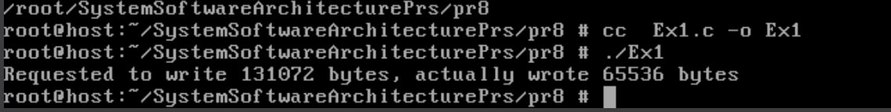
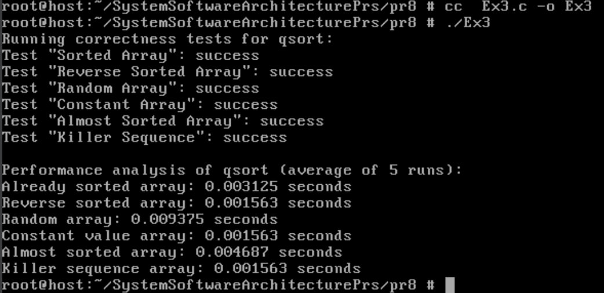
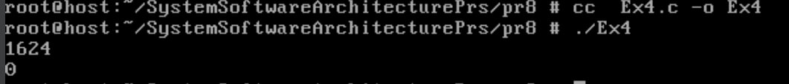
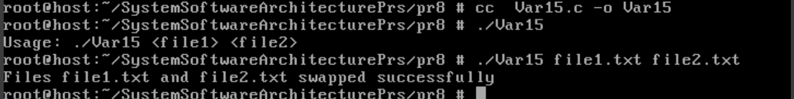

# Практична робота №5
## Завдання №1
Чи може виклик `count = write(fd, buffer, nbytes);` повернути в змінній count значення, відмінне від nbytes? Якщо так, то чому? Наведіть робочий приклад програми, яка демонструє вашу відповідь.
## Реалізація завдання

Було написано програму, у якій використовується пара каналів `pipe` для демонстрації. Канал створює буфер між процесами для обміну даними.

### Що відбувається:

1. Функція `pipe()` створює два файлові дескриптори:
   - `pipefd[0]` — для читання.
   - `pipefd[1]` — для запису.

2. За допомогою `fcntl()` встановлюється неблокуючий режим для дескриптора `pipefd[1]`. Це дозволяє функції `write()` не чекати, коли в буфері зʼявиться вільне місце, а одразу повернути кількість фактично записаних байтів або помилку.

3. Створюється буфер `buffer` розміром **128 KB**, який заповнюється символами `'A'` за допомогою `memset()`.

4. Виконується запис у канал через `write()`. Оскільки дескриптор встановлений у неблокуючий режим, можлива ситуація:
   - записано менше, ніж передбачалося (повертає кількість реально записаних байтів),
   - або повертає `-1`, якщо буфер переповнений.

5. Після виклику `write()` виводиться повідомлення про кількість байтів, які планувалося записати, і фактичну кількість записаних.

6. Дескриптори каналу закриваються за допомогою `close()`.

При виконанні програми можна побачити, що повернуте значення `count` може бути меншим за `nbytes` через обмежений розмір внутрішнього буфера каналу в неблокуючому режимі.

## Результат роботи:


## Завдання №2
Є файл, дескриптор якого — fd. Файл містить таку послідовність байтів: 4, 5, 2, 2, 3, 3, 7, 9, 1, 5. У програмі виконується наступна послідовність системних викликів:
+ lseek(fd, 3, SEEK_SET);
+ read(fd, &buffer, 4);

де виклик lseek переміщує покажчик на третій байт файлу. Що буде містити буфер після завершення виклику read? Наведіть робочий приклад програми, яка демонструє вашу відповідь.
## Реалізація завдання
Було створено програму для демонстрації роботи системних викликів `lseek()` і `read()`.

## Що відбувається:

1. Відкривається файл `testfile.bin` для читання та запису. Якщо файл не існує — він створюється.
2. У файл записується послідовність байтів: `4, 5, 2, 2, 3, 3, 7, 9, 1, 5`.
3. За допомогою `lseek()` покажчик встановлюється на **третій байт файлу** (тобто на значення `2` за індексом 3).
4. Виконується читання 4 байтів у масив `buffer`.
5. Зчитані байти виводяться у консоль.

## Результат роботи:


## Завдання №3
Бібліотечна функція qsort призначена для сортування даних будь-якого типу. Для її роботи необхідно підготувати функцію порівняння, яка викликається з qsort кожного разу, коли потрібно порівняти два значення. Оскільки значення можуть мати будь-який тип, у функцію порівняння передаються два вказівники типу void* на елементи, що порівнюються.
- Напишіть програму, яка досліджує, які вхідні дані є найгіршими для алгоритму швидкого сортування. Спробуйте знайти кілька масивів даних, які змушують qsort працювати якнайповільніше. Автоматизуйте процес експериментування так, щоб підбір і аналіз вхідних даних виконувалися самостійно.
- Придумайте і реалізуйте набір тестів для перевірки правильності функції qsort.

## Реалізація завдання
Програма перевіряє роботу стандартної функції `qsort()` для сортування цілих чисел.  
Досліджує, на яких масивах алгоритм працює повільніше, та перевіряє правильність сортування.

### Як працює

1. Генерує різні масиви:
   - Відсортований
   - У зворотному порядку
   - Випадковий
   - Константний
   - Майже відсортований
   - "Killer sequence"

2. Заміряє середній час сортування кожного масиву.
3. Перевіряє правильність сортування.

## Результат роботи:


## Завдання №4
Виконайте наступну програму на мові програмування С:
```
int main() {
  int pid;
  pid = fork();
  printf("%d\n", pid);
}
```
Завершіть цю програму. Припускаючи, що виклик `fork()` був успішним, яким може бути результат виконання цієї програми?
## Реалізація завдання
Припускаючи, що `fork()` успішний:
* У батьківському процесі буде надрукований PID дочірнього процесу (наприклад, 1624).
* У дочірньому процесі буде надруковано 0.

Програма виводить два числа, але порядок їх появи на екрані може бути довільним (залежить від того, який процес виконає printf першим).
## Результат роботи:


## ЗАВДАННЯ ПО ВАРІАНТАХ (15 ВАРІАНТ):
Розробіть утиліту, яка виконує атомарний обмін вмістом двох файлів без створення тимчасових.

## Реалізація завдання

Програма реалізує утиліту для атомарного обміну вмістом двох файлів без використання тимчасових файлів.

Основні кроки реалізації:

- Спочатку програма зчитує повний вміст кожного з файлів у пам’ять, використовуючи функції `fopen`, `fread`.
- Для забезпечення коректної та безпечної роботи з файлами одночасно, відкриває обидва файли у режимі запису (`open`) і застосовує блокування (`flock`), щоб уникнути конфліктів при доступі.
- Далі вміст першого файлу записується у другий і навпаки, використовуючи `fwrite`.
- Після завершення операцій знімається блокування, закриваються файли, а виділена пам’ять звільняється.
- Програма також перевіряє наявність файлів і обробляє помилки під час читання, запису та блокування.

Таким чином реалізовано безпечний та ефективний обмін даними між файлами без створення тимчасових проміжних файлів.
```

Якщо хочеш, можу ще трохи адаптувати під твій стиль — скажи!


## Результат роботи:
