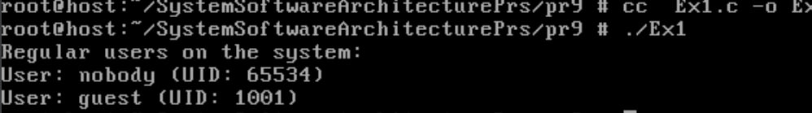
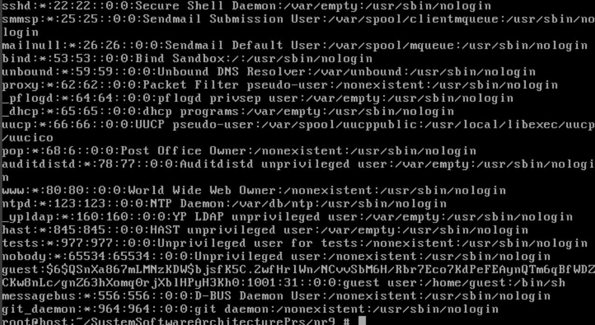
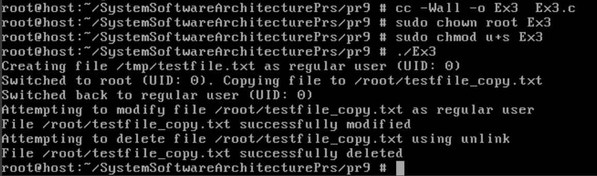
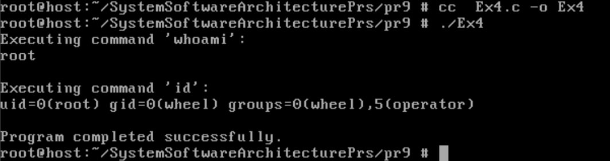
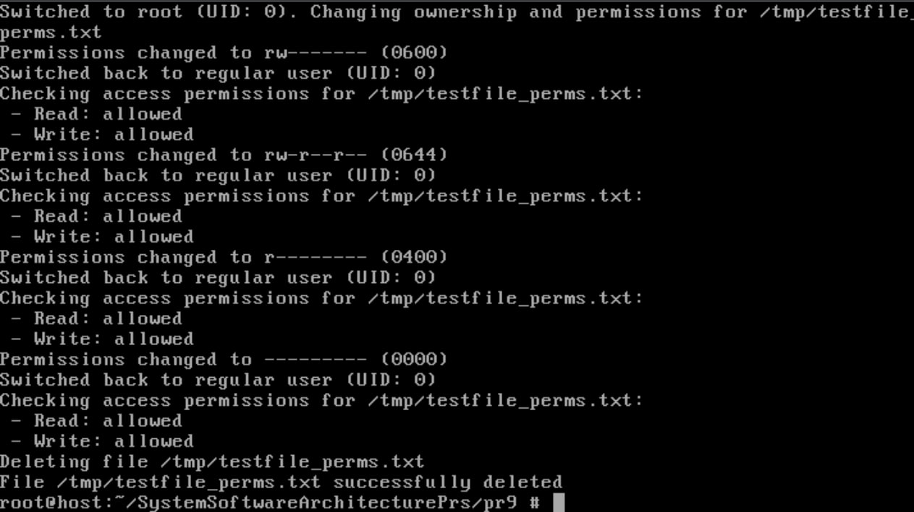
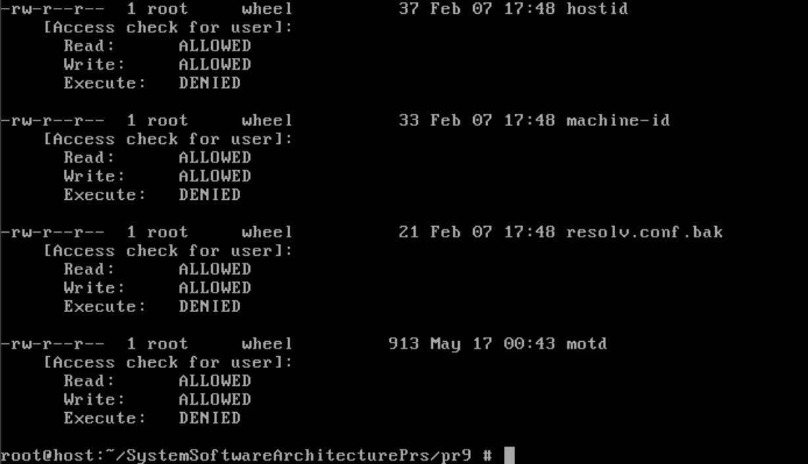

# Практична робота №9
## Завдання №1
Напишіть програму, яка читає файл /etc/passwd за допомогою команди getent passwd, щоб дізнатись, які облікові записи визначені на вашому комп’ютері. Програма повинна визначити, чи є серед них звичайні користувачі (ідентифікатори UID повинні бути більші за 500 або 1000, залежно від вашого дистрибутива), окрім вас.
## Реалізація завдання
Було написано програму, яка перевіряє облікові записи користувачів у системі через команду `getent passwd`, і визначає серед них звичайних користувачів з UID, більшим за заданий поріг, окрім поточного користувача.

## Опис реалізації

+ **Виклик команди `getent passwd`**  
  Використовується функція `popen()` для запуску команди `getent passwd` та читання її виводу. Команда повертає список усіх облікових записів користувачів із `/etc/passwd`.

+ **Отримання UID поточного користувача**  
  Функція `getuid()` визначає UID користувача, від імені якого запущено програму. Це дозволяє виключити поточного користувача зі списку перевірки.

+ **Обробка результатів команди**  
  Функція `fgets()` читає кожен рядок виводу `getent passwd`. Для розбору рядка використовується `strtok()` з роздільником `:`, щоб витягнути ім'я користувача та його UID.

+ **Перевірка UID та вивід інформації**  
  Отриманий UID переводиться у число за допомогою `atoi()`. Далі UID порівнюється з пороговим значенням `MIN_UID` (у програмі встановлено 1000). Якщо UID більший за цей поріг і не збігається з UID поточного користувача, інформація про користувача виводиться на екран.

+ **Завершення роботи програми**  
  Після обробки всіх рядків програма закриває потік командою `pclose()` і повертає код завершення 0.

## Результат роботи:


## Завдання №2
Напишіть програму, яка виконує команду cat /etc/shadow від імені адміністратора, хоча запускається від звичайного користувача. (Ваша програма повинна робити необхідне, виходячи з того, що конфігурація системи дозволяє отримувати адміністративний доступ за допомогою відповідної команди.)
## Реалізація завдання
Програма на мові C реалізує виконання системної команди для читання файлу /etc/master.passwd із правами адміністратора за допомогою sudo. Команда формується у вигляді рядка та виконується через функцію system(). Перед виконанням виводиться сама команда, після чого перевіряється код повернення: у разі помилки програма повідомляє про необхідність наявності доступу до sudo без пароля і завершується з кодом помилки. Вибір файлу /etc/master.passwd обумовлений особливостями FreeBSD, де цей файл містить інформацію про користувачів та їх зашифровані паролі, на відміну від Linux-систем, які використовують /etc/shadow, якого у FreeBSD немає. Таким чином, для отримання даних про користувачів із правами root у FreeBSD використовується саме /etc/master.passwd.

## Результат роботи:



## Завдання №3
Напишіть програму, яка від імені root копіює файл, який вона перед цим створила від імені звичайного користувача. Потім вона повинна помістити копію у домашній каталог звичайного користувача. Далі, використовуючи звичайний обліковий запис, програма намагається змінити файл і зберегти зміни. Що відбудеться? Після цього програма намагається видалити цей файл за допомогою команди rm. Що відбудеться?

## Реалізація завдання
Було створено програму, яка виконує послідовність операцій з файлами, імітуючи роботу від імені звичайного користувача та root. Спочатку програма створює файл у тимчасовій директорії `/tmp` від імені звичайного користувача з типовими правами доступу (0644). Далі, використовуючи системний виклик `setuid(0)`, програма підвищує свої привілеї до root, після чого копіює створений файл у домашній каталог звичайного користувача. Після копіювання вона знову переключається на звичайного користувача за допомогою `setuid(real_uid)`.

Програма потім намагається змінити скопійований файл у домашньому каталозі, відкриваючи його на дозапис. Якщо права на файл дозволяють запис для звичайного користувача, модифікація пройде успішно. Інакше буде виведено помилку доступу. Далі програма намагається видалити цей файл за допомогою `unlink()`. У більшості випадків, якщо файл належить користувачу і він має права на видалення, видалення пройде успішно.

Вибір саме такого сценарію демонструє, як змінюються права доступу при роботі від імені root і звичайного користувача, і показує, що root може створювати та копіювати файли з будь-якими правами, а звичайний користувач обмежений власними правами на файл у своєму домашньому каталозі.

---

### Ключові моменти:

- Отримання реального UID користувача (`getuid()`) та його домашнього каталогу (`getpwuid()`).
- Створення файлу від імені звичайного користувача з правами 0644.
- Перемикання на root (`setuid(0)`) для копіювання файлу.
- Повернення під звичайного користувача (`setuid(real_uid)`) для подальших дій.
- Спроба модифікувати файл звичайним користувачем із перевіркою на помилки.
- Спроба видалення файлу звичайним користувачем із перевіркою на помилки.

---

## Результат роботи:



## Завдання №4
Напишіть програму, яка по черзі виконує команди whoami та id, щоб перевірити стан облікового запису користувача, від імені якого вона запущена. Є ймовірність, що команда id виведе список різних груп, до яких ви належите. Програма повинна це продемонструвати.
## Реалізація завдання
Програма послідовно виконує дві системні команди `whoami` та `id` за допомогою функції `system()`. Спочатку вона виводить ім’я користувача, під яким запущений процес (`whoami`), а потім відображає детальну інформацію про цей обліковий запис, включно зі списком груп, до яких належить користувач (`id`). Якщо виконання будь-якої з команд завершується з помилкою, програма виводить відповідне повідомлення і завершує роботу з кодом помилки. В кінці повідомляє про успішне завершення. Такий підхід дозволяє перевірити та продемонструвати статус облікового запису користувача, що запускає програму.

## Результат роботи:



## Завдання №5
Напишіть програму, яка створює тимчасовий файл від імені звичайного користувача. Потім від імені суперкористувача використовує команди chown і chmod, щоб змінити тип володіння та права доступу. Програма повинна визначити, в яких випадках вона може виконувати читання та запис файлу, використовуючи свій обліковий запис.
## Реалізація завдання
Програма спочатку створює тимчасовий файл від імені звичайного користувача з правами 0644. Потім вона переключається на суперкористувача (root) для зміни власника файлу на root і послідовно встановлює різні права доступу (0600, 0644, 0400, 0000). Після кожної зміни прав програма повертається до звичайного користувача і перевіряє, чи має він права на читання і запис файлу, використовуючи функцію `access()`. Наприкінці файл видаляється від імені root, і програма завершується знову під звичайним користувачем. Така реалізація демонструє, як змінюється доступ користувача до файлу залежно від встановлених прав і власника.

## Результат роботи:



## Завдання №6
Напишіть програму, яка виконує команду ls -l, щоб переглянути власника і права доступу до файлів у своєму домашньому каталозі, в /usr/bin та в /etc. Продемонструйте, як ваша програма намагається обійти різні власники та права доступу користувачів, а також здійснює спроби читання, запису та виконання цих файлів.
## Реалізація завдання
Програма переглядає вміст трьох директорій: домашньої теки користувача, `/usr/bin` та `/etc`. Для кожного файлу виводяться права доступу, власник, група, розмір і дата останньої модифікації, подібно до `ls -l`. Далі відбувається перевірка, чи має користувач права на читання, запис і виконання файлу, за допомогою функції `access()`. Це демонструє, як різні права і власники впливають на доступ користувача до файлів у різних системних каталогах.

## Результат роботи:



## ЗАВДАННЯ ПО ВАРІАНТАХ (15 ВАРІАНТ):
Напишіть скрипт, що веде логування команд користувача. Як приховати його від ps?
## Реалізація завдання
Ця програма запускає оболонку (`sh` або `bash`), яка логує команди користувача у `/var/log/user_commands.log` з мітками часу та іменами користувачів. Процес приховується від `ps` шляхом встановлення назви процесу на `-[kernel]` за допомогою функції `setproctitle()`.

## Вимоги
- `bash` (опціонально, за замовчуванням `/bin/sh`)
- Права на запис у `/var/log/user_commands.log`
- Root-привілеї для `setuid`

## Встановлення

### 1. Компіляція вихідного коду
```bash
cc -o Var15 Var15.c -lutil
```

### 2. Встановлення відповідних прав
```bash
sudo chown root Var15
```
